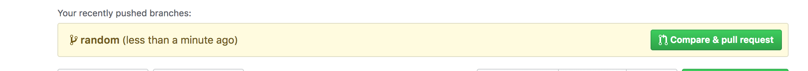
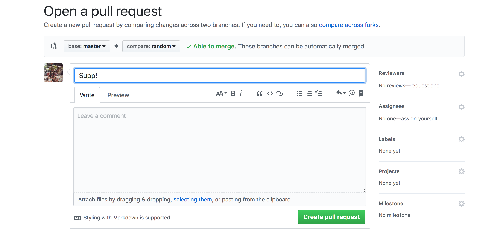
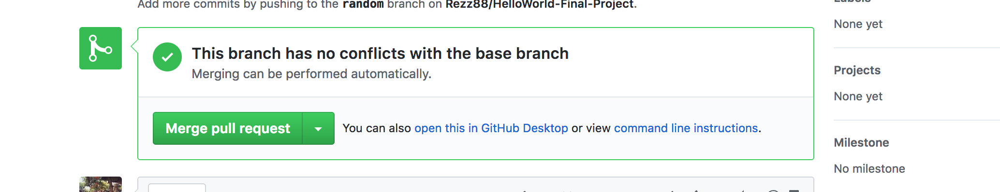

//FINAL-PROJECT README FILE
==

Git
--
(Initial git setup to copy from existing repoistory)
git clone

(Initial git setup to set up NEW repository)
git init
git remote add origin https://github.com/Rezz88/HelloWorld-Final-Project.git or whatever GitHub

(Daily git flow)
git add . (or specific file)
git commit -m (with detailed msg of changes ex - "Perez - Added editProfile function and removed error on main page" )
git push (must have most recent pull, before you can push)
git pull (stagging area must be cleared when you pull )

FrontEnd
--
When you first clone:
```npm install```

To start:
```npm run start```

BackEnd
--
When you first clone:
```npm install```

To start:
```npm run start```

### Git Workflow


1. Checkout the master branch before working on new feature and pull latest changes.

```git checkout master && git pull origin master```

2. Now your ready to checkout a new branch to begin working on a new feature

```git checkout -b <branch name>```

3. Once your ready git add and commit your changes.

```git add -A```

```git commit -m '<commit message>'```

4. Now we're ready to add the latest changes to our branch from master.

``` git pull --rebase origin master```

5. **If you have conflicts make sure you fix them before you push! if you do fix them in your IDE, save changes**

```git add -A && git rebase --continue```

6. Once you fixed your conflicts and or have no conflicts push your new branch to github

```git push origin <branch name>```

7. Go to github and create a new pull request to master
;

8. Make sure the base branch is master and there's no conflicts
;

9. When everything is good merge your branch into master
;

